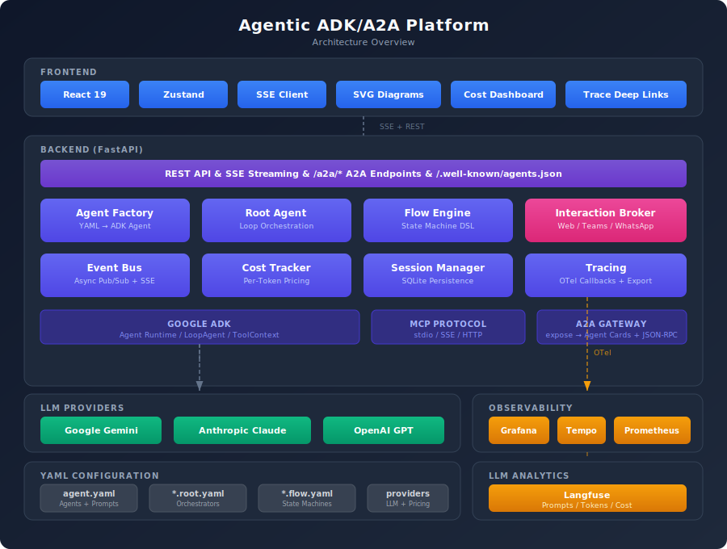

# Agentic ADK/A2A Platform

A modular, multi-agent AI platform built on [Google ADK](https://google.github.io/adk-docs/) (Agent Development Kit) and the [A2A](https://github.com/google/A2A) (Agent-to-Agent) protocol. Define agents declaratively in YAML, equip them with MCP tools, orchestrate complex workflows, and observe everything in real time.

<p align="center">
  
</p>

## Features

### Declarative Agents

Agents are defined entirely in YAML — model, prompt, tools, capabilities — no Python code needed. The platform supports Google Gemini, Anthropic Claude, and OpenAI GPT with automatic model fallback. Agents connect to external tools via MCP (Model Context Protocol) with per-agent tool filtering.

### Multi-Agent Orchestration

Root agents coordinate multiple sub-agents using ADK's loop strategy. Agents are selected dynamically based on capabilities, and the orchestrator manages the conversation flow, delegation, and result synthesis across all sub-agents.

### Flow Engine

A YAML-based state machine for structured, multi-step processes. Flows support agent tasks, LLM-powered decisions, human interactions, parallel branches, conditional routing, event-driven transitions, and sub-flow invocation. Template variables propagate data across states. Retry loops and timeouts are built in.

### Multi-Channel Interaction

Agents can interact with humans through a unified Interaction Broker that supports Web UI, Microsoft Teams (Adaptive Cards via Azure Bot Framework), and WhatsApp (Twilio). Flows suspend at interaction points and resume when the user responds — on any channel.

### Real-Time Cost Tracking

Every LLM call, tool invocation, and agent delegation is tracked with per-model token pricing. Costs are streamed to the frontend in real time and aggregated per task and flow.

### Observability

Three-level monitoring built on OpenTelemetry: distributed traces in Grafana/Tempo (full span waterfall from task down to individual LLM calls), metrics in Prometheus (latency, throughput, cost trends), and LLM-specific analytics in Langfuse (prompt/completion tracking, token usage). A pre-built Grafana dashboard is included. Zero overhead when tracing is disabled.

### Frontend

A React-based web UI for managing the entire platform: submit tasks with real-time streaming responses, trigger and monitor flows, manage agent definitions, browse available tools, track costs with hierarchical drill-down, and view SVG diagrams of agent call graphs and flow state machines — with deep links to Grafana and Langfuse traces.

### A2A Protocol

Implements Google's Agent-to-Agent protocol for inter-agent communication with agent discovery, capability-based routing, session continuity, and SSE streaming.

## Tech Stack

| Layer | Technology |
|-------|-----------|
| Backend | Python 3.12+, FastAPI, Uvicorn, Pydantic |
| Agent Framework | Google ADK, MCP protocol |
| LLM Providers | Google Gemini, Anthropic Claude, OpenAI GPT |
| Frontend | React 19, TypeScript, Vite, Zustand |
| Real-Time | Server-Sent Events (SSE) |
| Observability | OpenTelemetry, Grafana, Tempo, Prometheus, Langfuse |
| Infra | Docker, Docker Compose |

## Quick Start

```bash
cp .env.example .env
# Add your API key(s) to .env

# Windows:
run-dev.cmd

# Linux / macOS:
make docker-up
```

Open http://localhost:5173 and submit a task.

See [Getting Started](docs/getting-started.md) for detailed setup instructions.

## Documentation

| Document | Description |
|----------|-------------|
| [Getting Started](docs/getting-started.md) | Installation, configuration, and first run |
| [Architecture](docs/architecture.md) | Technical architecture deep-dive |
| [User Guide](docs/user-guide.md) | End-user guide for the web UI |
| [MCP Setup](docs/mcp-setup.md) | MCP tool configuration reference |
| [Channel Setup](docs/channel-setup.md) | Teams & WhatsApp integration |
| [Cost Tracking](docs/cost-tracking.md) | LLM cost tracking internals |
| [A2A Integration](docs/a2a-integration.md) | Google A2A protocol usage |

## Roadmap

The platform is built on Google ADK and A2A, positioning it for the emerging multi-agent ecosystem.

### Agent Capabilities
- **A2A Federation** — connect to external A2A-compatible agents as first-class sub-agents across organizations
- **Agent Marketplace** — import/export agent definitions as portable packages
- **Dynamic Agent Spawning** — root agents that create sub-agents at runtime based on task needs
- **Agent Memory** — long-term memory via vector stores for cross-session context
- **Multi-Modal Agents** — image, audio, and video processing within agent tasks

### Flow Engine
- **Visual Flow Builder** — drag-and-drop editor with live preview
- **Flow Versioning** — version control with rollback
- **Scheduled Flows** — cron-based triggers
- **Flow Templates** — reusable parameterized patterns (approval chains, data pipelines)
- **Conditional Retry Strategies** — exponential backoff, circuit breakers

### Observability & Analytics
- **Cost Budgets & Alerts** — per-task/per-agent cost limits with auto-stop
- **Agent Performance Benchmarks** — success rates, latency percentiles, quality scores
- **Prompt Analytics** — A/B testing via Langfuse experiments
- **Custom Grafana Alerts** — anomaly detection for cost, latency, errors

### Channels & Integration
- **Slack** — native bot integration
- **Email** — SMTP/IMAP for agent-driven email workflows
- **Webhooks** — generic adapter for external systems
- **Voice** — telephony integration

### Platform
- **Multi-Tenant Deployment** — authentication, access control, API key management
- **Agent Evaluation Framework** — automated testing with golden datasets and LLM-as-judge
- **Plugin System** — custom node types, exporters, and channel adapters
- **Kubernetes Deployment** — Helm charts with autoscaling
- **CLI Tool** — command-line agent/flow management
